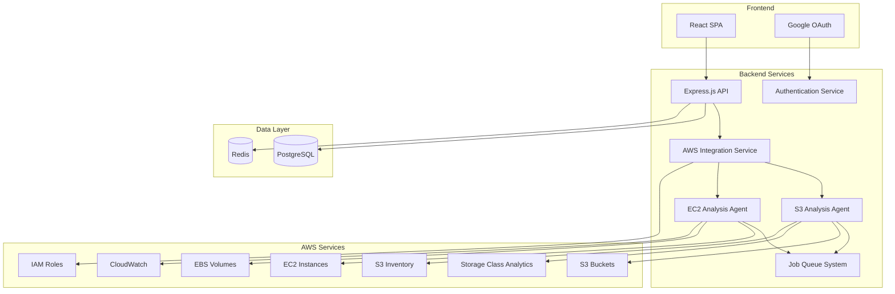

# HawkEye Design Document

## Overview

HawkEye is a cloud cost optimization platform built as a modern web application with a React frontend, Node.js backend, and PostgreSQL database. The system integrates with AWS services through IAM roles and service APIs to provide automated analysis and recommendations for S3 storage and EC2 resources. The architecture emphasizes security, scalability, and user experience while handling complex AWS data processing workflows.

## Architecture

### High-Level Architecture



### Technology Stack

- **Frontend/Backend**: Next.js 15 with App Router, React Server Components, TypeScript, Tailwind CSS v4
- **Runtime**: Bun for package management and runtime
- **UI Components**: shadcn/ui component library
- **Database**: PostgreSQL with Drizzle ORM
- **Queue**: Database-based job queue using PostgreSQL
- **AWS Integration**: AWS SDK v3
- **AI Integration**: Vercel AI SDK v5 with Google Gemini for report generation
- **Authentication**: Google OAuth 2.0 with NextAuth.js
- **Deployment**: Docker containers, potentially on AWS ECS/Fargate

## Components and Interfaces

### Frontend Components

#### Authentication Module

- **LoginPage**: Google OAuth integration with redirect handling
- **AuthProvider**: React context for authentication state management
- **ProtectedRoute**: Route wrapper for authenticated access

#### Onboarding Module

- **AccountOnboarding**: AWS account setup wizard
- **S3Onboarding**: Bucket selection and configuration interface
- **OnboardingProgress**: Step-by-step progress indicator

#### Dashboard Module

- **Dashboard**: Main analytics display with run controls
- **MetricsCards**: Cost savings and resource utilization widgets
- **RecommendationsList**: Actionable optimization suggestions
- **AnalysisStatus**: Real-time job progress indicators

### Backend Services (Next.js API Routes)

#### Authentication Service (NextAuth.js)

```typescript
interface AuthService {
  validateGoogleToken(token: string): Promise<UserProfile>;
  getSession(req: NextRequest): Promise<Session | null>;
  signIn(provider: string): Promise<void>;
}
```

#### AWS Integration Service

```typescript
interface AWSService {
  validateCredentials(roleArn: string): Promise<boolean>;
  assumeRole(roleArn: string): Promise<AWSCredentials>;
  listS3Buckets(credentials: AWSCredentials): Promise<S3Bucket[]>;
  enableStorageAnalytics(
    bucket: string,
    credentials: AWSCredentials
  ): Promise<void>;
  configureInventory(
    bucket: string,
    credentials: AWSCredentials
  ): Promise<void>;
}
```

#### Analysis Agents

```typescript
interface S3Agent {
  analyzeStorageOptimization(
    buckets: string[],
    credentials: AWSCredentials
  ): Promise<S3Recommendations>;
  getInventoryData(bucket: string): Promise<InventoryReport>;
  getStorageAnalytics(bucket: string): Promise<AnalyticsReport>;
  analyzeObjectAge(inventoryData: InventoryReport): Promise<AgeAnalysisResult>;
  detectParquetFileIssues(inventoryData: InventoryReport): Promise<ParquetAnalysisResult>;
  analyzePartitioningNeeds(inventoryData: InventoryReport): Promise<PartitioningAnalysisResult>;
}

interface EC2Agent {
  analyzeResourceUtilization(
    credentials: AWSCredentials
  ): Promise<EC2Recommendations>;
  findUnusedEBSVolumes(credentials: AWSCredentials): Promise<EBSVolume[]>;
  analyzeInstanceUtilization(
    credentials: AWSCredentials
  ): Promise<InstanceAnalysis[]>;
}
```

## Data Models

### User and Account Models

```typescript
interface User {
  id: string;
  googleId: string;
  email: string;
  name: string;
  createdAt: Date;
  updatedAt: Date;
  accounts: AWSAccount[];
}

interface AWSAccount {
  id: string;
  userId: string;
  accountId: string;
  roleArn: string;
  region: string;
  isActive: boolean;
  createdAt: Date;
  monitoredBuckets: S3BucketConfig[];
}

interface S3BucketConfig {
  id: string;
  accountId: string;
  bucketName: string;
  region: string;
  analyticsEnabled: boolean;
  inventoryEnabled: boolean;
  lastAnalyzed: Date;
}
```

### Analysis Results Models

```typescript
interface AnalysisRun {
  id: string;
  accountId: string;
  status: "pending" | "running" | "completed" | "failed";
  startedAt: Date;
  completedAt?: Date;
  s3Results?: S3AnalysisResult;
  ec2Results?: EC2AnalysisResult;
}

interface S3AnalysisResult {
  totalStorageGB: number;
  potentialSavings: number;
  recommendations: S3Recommendation[];
  ageAnalysis?: AgeAnalysisResult;
  parquetAnalysis?: ParquetAnalysisResult;
  partitioningAnalysis?: PartitioningAnalysisResult;
}

interface S3Recommendation {
  bucketName: string;
  objectCount: number;
  currentStorageClass: string;
  recommendedStorageClass: string;
  potentialSavings: number;
  confidence: number;
  category: "cost" | "security" | "general";
  aiGeneratedReport: string;
}

interface AgeAnalysisResult {
  bucketName: string;
  oldObjectsCount: number;
  oldObjectsTotalSize: number;
  averageAge: number;
  recommendedLifecyclePolicy: LifecyclePolicyRecommendation;
  potentialSavings: number;
}

interface ParquetAnalysisResult {
  bucketName: string;
  parquetFileCount: number;
  averageFileSize: number;
  recommendCompaction: boolean;
  estimatedCompactionSavings: number;
  suggestedCompactionStrategy: string;
}

interface PartitioningAnalysisResult {
  bucketName: string;
  totalFiles: number;
  directoriesWithTooManyFiles: DirectoryAnalysis[];
  recommendPartitioning: boolean;
  suggestedPartitioningStrategy: string;
}

interface DirectoryAnalysis {
  path: string;
  fileCount: number;
  averageFileSize: number;
  recommendedPartitionScheme: string;
}

interface LifecyclePolicyRecommendation {
  transitionToIA: number; // days
  transitionToGlacier: number; // days
  deleteAfter?: number; // days
}

interface EC2AnalysisResult {
  totalInstances: number;
  unusedEBSVolumes: EBSRecommendation[];
  utilizationRecommendations: EC2Recommendation[];
  potentialSavings: number;
}

interface EC2Recommendation {
  instanceId: string;
  instanceType: string;
  recommendationType: string;
  category: "cost" | "security" | "general";
  potentialSavings: number;
  aiGeneratedReport: string;
}

interface EBSRecommendation {
  volumeId: string;
  size: number;
  volumeType: string;
  category: "cost" | "security" | "general";
  potentialSavings: number;
  aiGeneratedReport: string;
}
```

## Error Handling

### Frontend Error Handling

- **Global Error Boundary**: Catches and displays React component errors
- **API Error Interceptor**: Handles HTTP errors with user-friendly messages
- **Retry Logic**: Automatic retry for transient failures with exponential backoff
- **Offline Support**: Queue actions when network is unavailable

### Backend Error Handling

- **Structured Logging**: Winston logger with correlation IDs
- **AWS Error Mapping**: Convert AWS SDK errors to user-friendly messages
- **Circuit Breaker**: Prevent cascading failures in AWS API calls
- **Dead Letter Queue**: Handle failed background jobs with retry policies

### Error Categories

1. **Authentication Errors**: Invalid tokens, expired sessions
2. **Authorization Errors**: Insufficient AWS permissions
3. **AWS Service Errors**: Rate limiting, service unavailability
4. **Data Validation Errors**: Invalid input parameters
5. **System Errors**: Database connectivity, internal server errors

## Testing Strategy

### Frontend Testing

- **Unit Tests**: Jest and React Testing Library for components
- **Integration Tests**: Mock Service Worker for API interactions
- **E2E Tests**: Playwright for critical user journeys
- **Visual Regression**: Chromatic for UI consistency

### Backend Testing

- **Unit Tests**: Jest for service layer and utilities
- **Integration Tests**: Supertest for API endpoints
- **AWS Integration Tests**: LocalStack for AWS service mocking
- **Load Tests**: Artillery for performance validation

### Test Data Management

- **Database Seeding**: Drizzle seed scripts for consistent test data
- **AWS Mocking**: Mock AWS SDK responses for predictable testing
- **Test Isolation**: Database transactions for test cleanup

### Continuous Integration

- **Pre-commit Hooks**: ESLint, Prettier, type checking
- **PR Validation**: Full test suite execution
- **Security Scanning**: Dependency vulnerability checks
- **Code Coverage**: Minimum 80% coverage requirement

## Security Considerations

### Authentication & Authorization

- **OAuth 2.0**: Secure Google authentication flow
- **JWT Tokens**: Short-lived access tokens with refresh mechanism
- **Role-Based Access**: User permissions for AWS account management

### AWS Security

- **IAM Roles**: Cross-account access with minimal permissions
- **Credential Management**: Temporary credentials with STS
- **API Rate Limiting**: Prevent abuse of AWS APIs
- **Audit Logging**: Track all AWS API calls and user actions

### Data Protection

- **Encryption at Rest**: Database encryption for sensitive data
- **Encryption in Transit**: HTTPS/TLS for all communications
- **PII Handling**: Minimal collection and secure storage of user data
- **Data Retention**: Automatic cleanup of old analysis results

## S3 Inventory-Based Analysis Strategy

### Inventory Report Processing

The S3 analysis system uses S3 Inventory reports instead of direct object listing to avoid cross-region access issues and improve performance for large buckets.

#### Object Age Analysis Algorithm

```typescript
interface ObjectAgeAnalyzer {
  analyzeObjectAge(inventoryData: InventoryReport): AgeAnalysisResult;
  
  // Algorithm steps:
  // 1. Parse inventory CSV/Parquet files
  // 2. Calculate object age from LastModifiedDate
  // 3. Identify objects older than configurable thresholds (30, 90, 365 days)
  // 4. Calculate storage costs for old objects
  // 5. Generate lifecycle policy recommendations
  // 6. Estimate cost savings from lifecycle transitions
}
```

#### Parquet File Compaction Detection

```typescript
interface ParquetAnalyzer {
  detectCompactionNeeds(inventoryData: InventoryReport): ParquetAnalysisResult;
  
  // Algorithm steps:
  // 1. Filter objects by .parquet extension
  // 2. Group parquet files by directory/partition
  // 3. Calculate average file size per directory
  // 4. Identify directories with many small parquet files (< 128MB)
  // 5. Recommend compaction when file count > threshold and avg size < threshold
  // 6. Estimate storage and query performance improvements
}
```

#### Partitioning Strategy Analysis

```typescript
interface PartitioningAnalyzer {
  analyzePartitioningNeeds(inventoryData: InventoryReport): PartitioningAnalysisResult;
  
  // Algorithm steps:
  // 1. Analyze directory structure and file distribution
  // 2. Identify directories with excessive file counts (> 1000 files)
  // 3. Analyze file naming patterns for potential partition keys
  // 4. Detect date/time patterns in object keys
  // 5. Recommend partitioning schemes (by date, size, type)
  // 6. Estimate query performance improvements
}
```

### Error Handling for Cross-Region Buckets

- **PermanentRedirect Handling**: Detect 301 redirects and retry with correct regional endpoint
- **Inventory Fallback**: Use inventory reports when direct access fails
- **Regional Discovery**: Automatically detect bucket regions from inventory metadata
- **Graceful Degradation**: Provide partial analysis when some buckets are inaccessible

## Performance Optimization

### Caching Strategy

- **Next.js Cache**: Built-in caching for API routes and static generation
- **Browser Cache**: Static assets and API responses
- **Database Indexing**: Optimized queries for dashboard data

### Background Processing

- **Database Job Queue**: PostgreSQL-based job queue for analysis execution
- **Batch Processing**: Efficient AWS API usage
- **Progress Tracking**: Real-time job status updates via database polling

### Scalability

- **Horizontal Scaling**: Stateless API servers
- **Database Optimization**: Connection pooling and query optimization
- **CDN Integration**: Static asset delivery optimization
